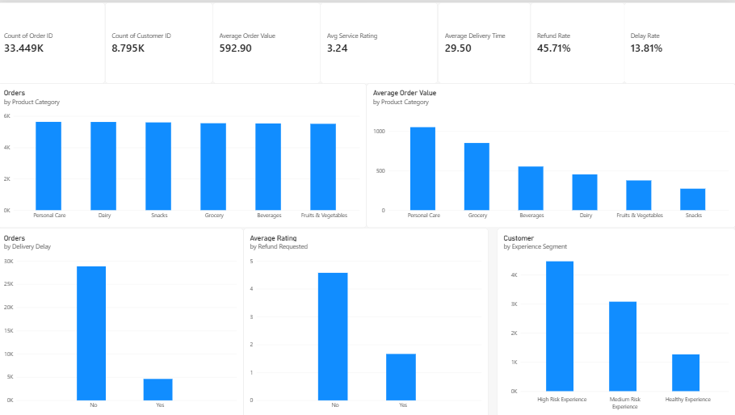
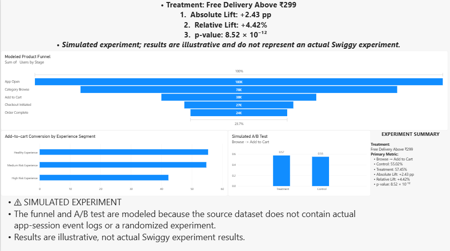

# Swiggy Instamart Growth Analytics: Funnel Optimization & A/B Testing

## Project Overview

A product analytics case study focused on customer experience, funnel friction, and experiment design for an Instamart-style quick-commerce product.

The analysis combines:

- Order-level customer and operational analysis
- Customer experience segmentation
- A **synthetic product funnel** because the source dataset does not contain app-event/session logs
- A **simulated A/B test** for a "Free Delivery Above ₹299" badge
- Statistical testing and experiment sizing
- Power BI dashboard design for business storytelling

> **Important methodology note:** The funnel and A/B test are modeled/simulated analyses, not real Swiggy event logs or production experiment results. The source data contains completed-order records rather than true app-event instrumentation.

---

## Dataset

**Source file:** `Ecommerce_Delivery_Analytics_New.csv`

### Instamart Data

- 33,449 Instamart orders
- 8,795 unique customers across the cleaned Instamart dataset
- 6,983 unique customers in the valid-timestamp subset used for temporal/customer-history analysis
- Valid timestamps cover only one calendar day
- Genuine multi-week retention/churn analysis was therefore not claimed

---

# Key Business Insights

## 1. Refund requests are strongly associated with lower ratings

| Refund Status | Average Service Rating |
|---|---:|
| No refund | 4.57 |
| Refund requested | 1.66 |

Refund-requested orders have substantially lower average service ratings in the observed data.

This is an association and should not be interpreted as proof that refunds themselves caused lower ratings.

---

## 2. Delivery delays are associated with materially longer delivery times

| Delivery Status | Average Delivery Time |
|---|---:|
| No delay | 26.94 min |
| Delayed | 45.56 min |

The difference is approximately **18.62 minutes**.

This indicates a strong relationship between the recorded delay status and delivery duration in the analyzed data.

---

## 3. Customer Experience Segmentation

Customers were classified into three rule-based experience segments using historical rating, delay rate and refund rate.

### Segmentation Rules

- **High Risk:** rating < 3 OR delay rate > 30% OR refund rate > 50%
- **Medium Risk:** rating < 4 OR delay rate > 15% OR refund rate > 25%
- **Healthy:** otherwise

### Customer Counts

| Experience Segment | Customers |
|---|---:|
| High Risk Experience | 3,662 |
| Medium Risk Experience | 1,440 |
| Healthy Experience | 1,881 |

The segmentation is **rule-based**, rather than an ML clustering model.

---

# Product Funnel Analysis

## 4. Modeled Funnel Friction

Because the source dataset contains completed-order records rather than actual app-session events, a **synthetic 100,000-session funnel** was created to demonstrate product funnel analysis.

### Funnel

**App Open → Category Browse → Add to Cart → Checkout Initiated → Order Complete**

| Funnel Stage | Sessions |
|---|---:|
| App Open | 100,000 |
| Category Browse | 77,640 |
| Add to Cart | 37,974 |
| Checkout Initiated | 26,724 |
| Order Complete | 23,710 |

### Modeled Conversion

- App → Browse: **77.64%**
- Browse → Cart: **48.91%**
- Cart → Checkout: **70.37%**
- Checkout → Complete: **88.72%**
- Overall App → Complete: **23.71%**

The largest modeled drop-off occurs at:

**Browse → Add to Cart: 51.09%**

This identifies the browse-to-cart stage as the primary area for further investigation using real product-event data.

---

## 5. Experience Segments Show Modeled Funnel Differences

In the synthetic scenario:

| Experience Segment | Browse → Add to Cart |
|---|---:|
| Healthy Experience | ~55.35% |
| Medium Risk Experience | ~54.77% |
| High Risk Experience | ~42.30% |

The simulation therefore shows a modeled difference in funnel conversion across experience segments.

> This is a **modeled association generated from the synthetic funnel**, not causal evidence that customer experience directly causes lower conversion.

---

# Simulated A/B Test

## Experiment Design

### Hypothesis

A more visible value proposition at the browse stage may influence users' decision to add products to their cart.

### Experiment

**Control:** Normal experience

**Treatment:** "Free Delivery Above ₹299" badge

**Primary Metric:** Browse → Add-to-Cart conversion

The metric was selected because Browse → Add to Cart represented the largest modeled funnel drop-off.

---

## Simulated Results

| Variant | Browse → Add to Cart |
|---|---:|
| Control | 55.02% |
| Treatment | 57.45% |

### Statistical Results

- **Absolute lift:** +2.43 percentage points
- **Relative lift:** +4.42%
- **p-value:** 8.52 × 10⁻¹²
- **95% CI for treatment − control:** +1.73 to +3.13 percentage points
- **Required sample size for 80% power:** 5,104 per group
- **Estimated gross incremental revenue:** ~₹14.42 lakh per 100,000 eligible browsing sessions

---

## Critical Interpretation

The treatment effect of **5% relative lift** was an **assumption used to generate the simulated treatment outcomes**.

Therefore, the simulated p-value and confidence interval demonstrate the statistical testing workflow but **do not establish that an actual Swiggy badge would generate a 4.42% lift**.

The revenue figure represents **illustrative gross incremental revenue**, not net contribution. A real business case would need to account for incremental delivery, promotion and other associated costs.

---

# Product Recommendations

Based on the observed data and modeled analysis, areas for further investigation include:

1. Investigate Browse → Add-to-Cart friction using real product-event instrumentation.
2. Segment funnel performance using customer-experience indicators such as delivery reliability, refunds and ratings.
3. Test value propositions and pricing/delivery messaging through a real randomized experiment.
4. Investigate the operational drivers underlying the strong association between refunds and lower ratings.
5. Monitor delivery delays as a service-quality metric because delayed orders were associated with substantially longer delivery times.
6. Evaluate experiments using incremental contribution margin rather than gross revenue alone.

---

# Power BI Dashboard

## Page 1 — Executive Overview

The dashboard provides an overview of:

- Total orders
- Unique customers
- Average order value
- Average delivery time
- Average service rating
- Refund rate
- Delay rate
- Orders by product category
- Average order value by category
- Orders by delivery delay
- Average rating by refund status
- Rule-based customer experience segments



---

## Page 2 — Funnel & Experimentation

The second dashboard connects the customer-experience analysis with product experimentation.

It includes:

- Modeled product funnel
- Funnel stage conversion/drop-off
- Experience-segment funnel comparison
- Simulated A/B test
- Absolute and relative lift
- Statistical significance
- Confidence interval
- Experiment assumptions and limitations



> **Important:** The funnel and A/B test are modeled/simulated because the source dataset does not contain actual app-session event logs or a randomized experiment. These results are illustrative and should not be interpreted as actual Swiggy experiment results.

---

# Tech Stack

- **Python**
- **Pandas**
- **NumPy**
- **Matplotlib**
- **Statistical Testing**
- **Power BI**
- **DAX**
- **Jupyter Notebook**
- **VS Code**
- **GitHub**

---

# Repository Structure

```text
Swiggy_Instamart_Analytics/
│
├── charts/
│   ├── 01_executive_overview.png
│   └── 02_funnel_ab_testing.png
│
├── notebooks/
│   ├── 01_data_preparation.ipynb
│   └── 02_product_funnel_analysis.ipynb
│
├── outputs/
│   └── project_metrics.csv
│
├── requirements.txt
├── Swiggy_Instamart_Product_Analytics.pbix
└── README.md
