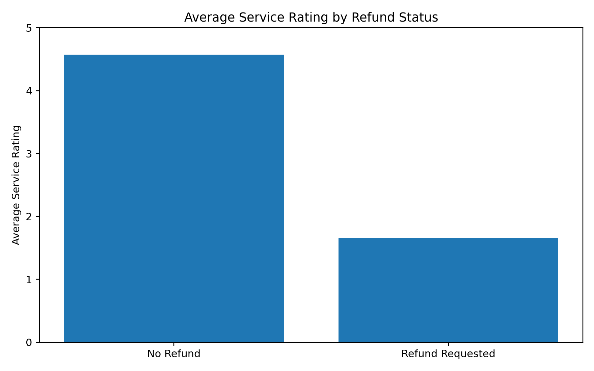
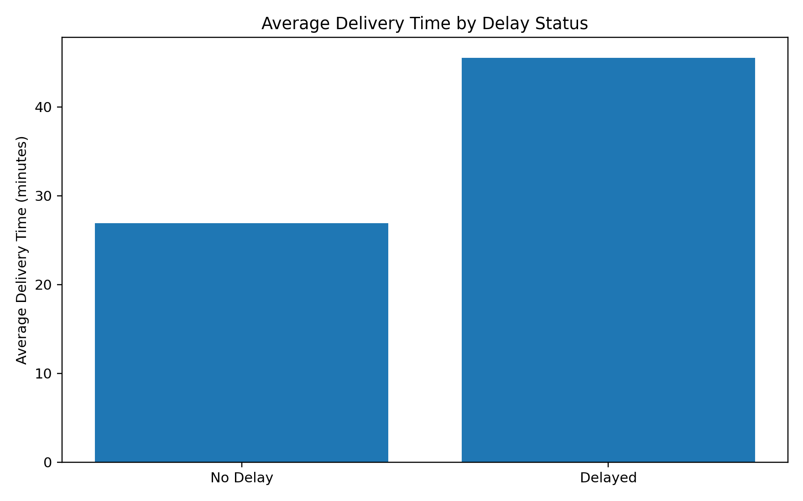
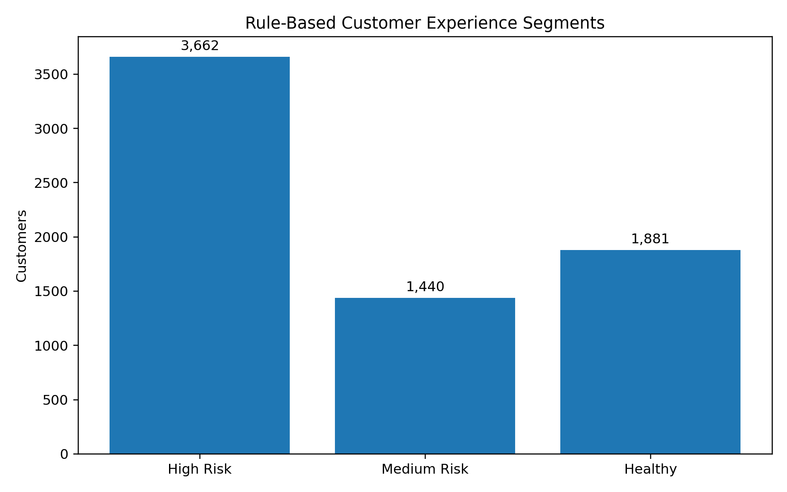
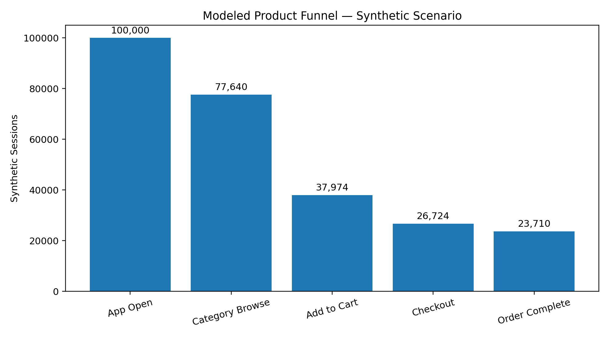
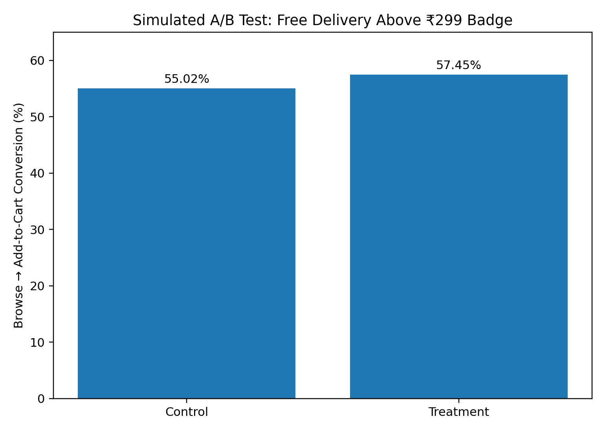

# Swiggy Instamart Growth Analytics: Funnel Optimization & A/B Testing

## Project Overview

A product analytics case study focused on customer experience, funnel
friction, and experiment design for an Instamart-style quick-commerce
product.

The analysis combines: - Order-level customer and operational analysis -
Customer experience segmentation - A **synthetic product funnel**
because the source dataset does not contain app-event/session logs - A
**simulated A/B test** for a "Free Delivery Above ₹299" badge - Power BI
dashboard design for business storytelling

> **Important methodology note:** The funnel and A/B test are
> modeled/simulated analyses, not real Swiggy event logs or production
> experiment results. The source data contains completed-order records
> rather than true app-event instrumentation.

## Dataset

Source file: `Ecommerce_Delivery_Analytics_New.csv`

Instamart records: - 33,449 orders - 6,983 unique customers in the
valid-timestamp subset - Valid timestamps cover only one calendar day,
so genuine multi-week retention/churn analysis was not claimed.

## Key Business Insights

### 1. Refund requests are strongly associated with lower ratings

  Refund status        Average service rating
  ------------------ ------------------------
  No refund                              4.57
  Refund requested                       1.66

This is a strong association in the dataset. It should not be
interpreted as proof that refunds themselves caused the lower ratings.



### 2. Delivery delays are associated with materially longer delivery times

  Delivery status     Average delivery time
  ----------------- -----------------------
  No delay                        26.94 min
  Delayed                         45.56 min

The difference is approximately **18.62 minutes**.



### 3. A substantial customer population falls into the high-risk experience segment

Rule-based segmentation used: - High Risk: rating \< 3 OR delay rate \>
30% OR refund rate \> 50% - Medium Risk: rating \< 4 OR delay rate \>
15% OR refund rate \> 25% - Otherwise: Healthy

Customer counts: - High Risk: 3,662 - Medium Risk: 1,440 - Healthy:
1,881



### 4. Modeled funnel friction is concentrated at Browse → Add to Cart

A synthetic 100,000-session funnel was created using historical
customer-experience features to demonstrate funnel analysis.

  Funnel stage           Sessions
  -------------------- ----------
  App Open                100,000
  Category Browse          77,640
  Add to Cart              37,974
  Checkout Initiated       26,724
  Order Complete           23,710

Modeled conversion: - App → Browse: 77.64% - Browse → Cart: 48.91% -
Cart → Checkout: 70.37% - Checkout → Complete: 88.72% - Overall App →
Complete: 23.71%

The largest modeled drop-off is **Browse → Add to Cart: 51.09%**.



### 5. Customer experience segments show modeled funnel differences

In the synthetic scenario: - Healthy customers had modeled Browse → Cart
conversion of about **55.35%** - High-risk customers had modeled Browse
→ Cart conversion of about **42.30%**

This gap is a modeled association generated from the simulation, not
causal evidence.

## Simulated A/B Test

### Experiment

**Control:** Normal experience\
**Treatment:** "Free Delivery Above ₹299" badge

**Primary metric:** Browse → Add-to-Cart conversion

The metric was selected because Browse → Cart represented the largest
modeled funnel drop-off.

  Variant       Browse → Cart
  ----------- ---------------
  Control              55.02%
  Treatment            57.45%

Simulated result: - Absolute lift: **+2.43 percentage points** -
Relative lift: **+4.42%** - p-value: **8.52 × 10⁻¹²** - 95% CI for
treatment − control: **+1.73 to +3.13 pp** - Required sample size for
80% power: **5,104 per group** - Estimated incremental gross revenue for
100,000 eligible browsing sessions: **₹14.42 lakh**



### Critical interpretation

The treatment effect of 5% relative lift was an **assumption used to
generate the simulated treatment outcomes**. Therefore, the simulated
p-value and confidence interval demonstrate the statistical testing
workflow but do **not** establish that an actual Swiggy badge would
generate a 4.42% lift.

The revenue figure is **gross incremental revenue**, not net
contribution. A real business case would subtract incremental
delivery/promotion costs.

## Product Recommendations

1.  Investigate the Browse → Add-to-Cart friction through real event
    instrumentation.
2.  Segment funnel performance by customer experience indicators such as
    delivery reliability, refunds, and ratings.
3.  Improve visibility of value propositions at the browse stage and
    validate them through a real randomized experiment.
4.  Treat refund-related low ratings as a customer-experience signal and
    investigate the underlying operational causes.
5.  Monitor delayed orders as a service-quality metric because delayed
    orders were associated with substantially longer delivery times.

## Power BI Dashboard

### Page 1 --- Customer & Business Overview

-   Total orders
-   Unique customers
-   Average order value
-   Average delivery time
-   Average service rating
-   Refund rate
-   Delay rate
-   Orders by product category
-   AOV by category
-   Orders by delay status
-   Average rating by refund status
-   Rule-based customer experience segments

### Page 2 --- Funnel & Experiment

-   Synthetic funnel
-   Stage conversion/drop-off
-   Segment funnel comparison
-   Simulated A/B test results
-   Lift, confidence interval and p-value
-   Revenue opportunity scenario

## Tech Stack

-   Python
-   Pandas
-   NumPy
-   Matplotlib
-   Statistical testing
-   Power BI
-   DAX
-   Jupyter / VS Code

## Repository Structure

``` text
Swiggy_Instamart_Analytics/
├── data/
├── notebooks/
│   ├── 01_data_preparation.ipynb
│   └── 02_product_funnel_analysis.ipynb
├── outputs/
│   ├── figures/
│   ├── tables/
│   └── powerbi/
├── src/
├── requirements.txt
└── README.md
```

## Limitations

-   The source dataset does not provide genuine app/session event logs.
-   The funnel is therefore synthetic/model-based.
-   The A/B test is simulated and uses an assumed treatment effect.
-   Valid timestamp data spans only one day, so multi-week
    retention/churn was intentionally excluded.
-   Associations are not interpreted as causal effects without
    randomized or longitudinal evidence.
